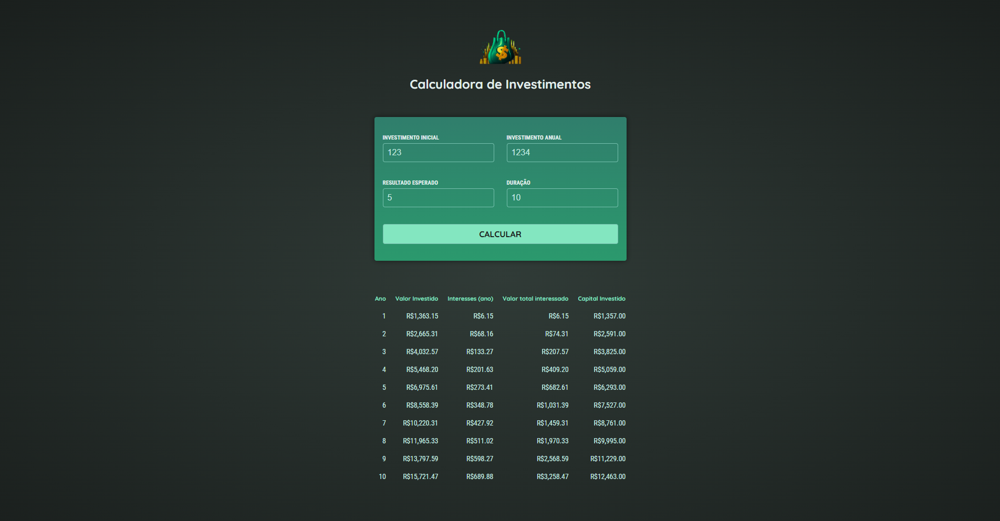

# Calculadora de Investimentos

Aplicação web desenvolvida em Angular para simular investimentos com aportes anuais e taxa de juros composta. O sistema exibe a evolução do capital ano a ano, destacando os valores investidos, juros recebidos e o total acumulado.

## 📸 Preview



---

## Funcionalidades

- Inserção de valor inicial, aporte anual, taxa de juros e duração.
- Cálculo automático de juros compostos.
- Tabela com detalhamento por ano:
  - Valor total investido
  - Juros acumulados
  - Juros do ano
  - Capital investido

## Como executar o projeto

1. Clone o projeto

```bash
git clone https://github.com/WalyssonCavalcante/Calculadora-de-Investimentos.git
```

2. Acesse a pagina do projeto

```bash
cd Calculadora-de-Investimentos
```

3. Instale as dependencias:

```bash
npm install
```

4. inicie o servidor de desenvolvimento e entao acesse o localhost fornecido:

```bash
ng serve
```
